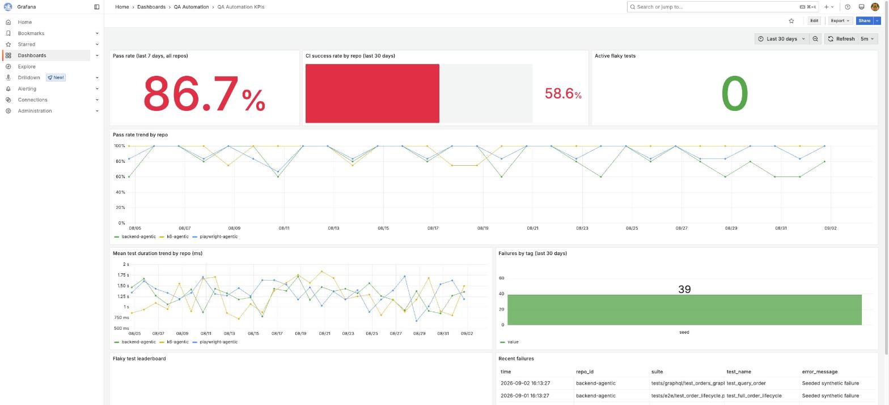
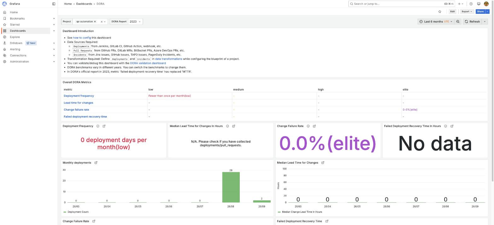

# KPI-Dashboard

QA Automation KPI Dashboard -- a fully worked example of Apache DevLake + Grafana OSS for engineering/DORA analytics, extended with a small custom pipeline for test-level QA KPIs (pass rate, flaky tests, CI health) that DevLake doesn't natively ingest. Built to demo against three sibling repos in this org (`playwright-agentic`, `k6-agentic`, `backend-agentic`) and works out of the box on synthetic data with zero credentials.

See [`ARCHITECTURE.md`](ARCHITECTURE.md) for the full design and the reasoning behind each piece.

## Quickstart

```bash
git clone https://github.com/autom8ion/KPI-Dashboard.git && cd KPI-Dashboard
cp .env.example .env       # optionally add GITHUB_TOKEN for live data; blank = seeded demo
make demo                  # docker compose up, configure DevLake, seed ~30 days of sample data
```

Then open:

- **Grafana** — http://localhost:4000/grafana (`admin`/`admin` on first login) — see the **QA Automation** folder for the new dashboard this repo adds, and DevLake's own **General** folder (DORA, Github, Jira, Homepage — provisioned automatically by DevLake's Grafana image, no setup needed) for engineering analytics.
- **DevLake Config UI** — http://localhost:4000 — connections, projects, blueprints.

`make demo` seeds everything so the dashboards are populated immediately. To pull *real* GitHub Actions results instead: put a token in `.env` and run `make ingest`. See `make help`-equivalent targets in the [`Makefile`](Makefile): `up`, `down`, `bootstrap`, `seed`, `ingest`, `report`, `clean`.

## Screenshots

**QA Automation KPIs** — this repo's own dashboard: pass rate, CI success rate, flaky tests, per-repo trends, recent failures.



**DORA** — DevLake's own dashboard, computed from the same seeded deployments/incidents.



## What's real vs. seeded

| Data | Source | Needs |
|---|---|---|
| GitHub PRs, commits, issues, CI pipeline runs | DevLake's GitHub plugin | `GITHUB_TOKEN` in `.env` |
| Test-case pass/fail/duration/flaky | `qa_collector` (this repo, JUnit/k6-summary/CTRF artifacts) | `GITHUB_TOKEN`, plus the sibling repos' CI changes (already applied — see their `feat/qa-kpi-dashboard-integration` branches) |
| DORA deployments/incidents/bugs | Seeded via DevLake's webhook plugin | nothing — synthetic by default |
| Jira issues | Seeded (synthetic, Jira-shaped) | nothing by default; swap for a real Jira connection any time, see `docs/dora-metrics.md` |
| Claude KPI report | `qa-kpi-report` skill (`make report`) | a working `claude` CLI locally, or `ANTHROPIC_API_KEY` in CI |

## Example report

`make report` (or the `qa-kpi-report.yml` workflow) runs the `qa-kpi-report` skill to turn the
week's numbers into a short narrative like this one. [`reports/2026-09-03.md`](reports/2026-09-03.md)
is a real example generated against `make demo`'s synthetic seed data:

> Overall pass rate slipped from 94.3% to 86.7% week-over-week, driven almost entirely by
> `backend-agentic`: its GraphQL suite's `test_query_order` started failing on 2026-08-28 and
> hasn't recovered, dragging that repo's CI success rate to 0% for the week (down from 57.1%).
> `playwright-agentic` also softened (CI success 71.4% → 50.0%) but stayed above a 90% pass
> rate; `k6-agentic` held steady at 100%.
>
> **Recommended actions:** quarantine `test_query_order` and investigate the GraphQL
> schema/resolver change around 2026-08-28 — it's the single highest-leverage fix...

See the full file for the DORA/regressions/flaky-tests breakdown and the rest of the
recommendations.

## Repo layout

```
qa_collector/        Test-result ingestion: GitHub Actions artifacts -> qa-postgres
devlake/scripts/      DevLake connection/scope config-as-code
scripts/seed/          Synthetic demo data generator
grafana/               Provisioned datasource + the QA Automation KPIs dashboard
docs/                  Metric definitions and DORA source mapping
.github/workflows/     The always-on ingestion + weekly report pipelines (for a real deployment)
.claude/skills/        Claude Code skills for operating this stack (see CLAUDE.md)
```

## Why these three repos

`playwright-agentic`, `k6-agentic`, and `backend-agentic` are this org's existing QA automation frameworks (Playwright E2E/API, k6 performance, pytest backend), each already following a Claude Code "constitution + skills" pattern of their own. This dashboard is the natural next layer on top: turn what those frameworks already produce in CI into KPIs a team actually watches.
